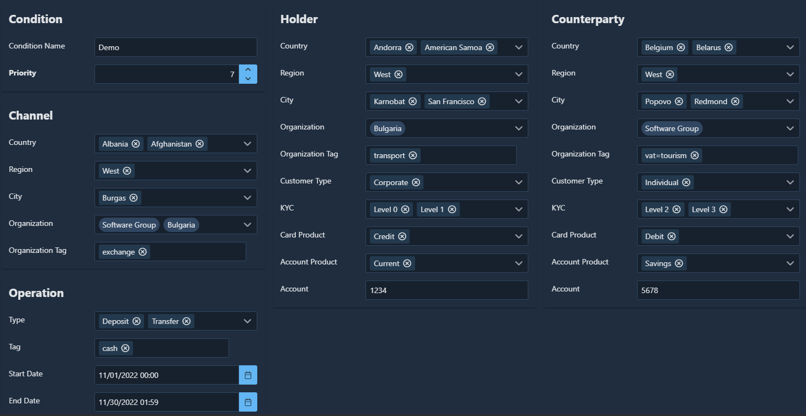

# UT Rule

Provides standard fees, limits and commissions API.

## Factor abbreviations

* so - source organization
* do - destination organization
* co - channel organization
* ss - source spatial
* ds - destination spatial
* cs - channel spatial
* oc - operation category
* sc - source category
* dc - destination category
* sk - source KYC
* st - source type
* dk - destination KYC
* dt - destination type
* sp - source Account Fee Policy
* dp - destination Account Fee Policy
* tp - transfer property

## Placeholders

* channel.id
* channel.id^X
* channel.role
* channel.role^X
* channel.country
* channel.region
* channel.city

* operation.id
* operation.currency

* source.owner.id
* source.owner.id^X
* source.country
* source.region
* source.city
* source.account.product
* source.card
* source.account.id
* source.account.number

* destination.owner.id
* destination.owner.id^X
* destination.country
* destination.region
* destination.city
* destination.account.product
* destination.account.id
* destination.account.number

* agentOf.owner.id
* agentOf.owner.id^X

## Condition



```yaml
condition:
  - conditionId: 1000
    priority: 7
    operationStartDate: '2022-10-31T22:00:32.577'
    operationEndDate: '2022-11-29T23:59:59.997'
    sourceAccountId: 1234
    destinationAccountId: 5678
    isDeleted: 0
    createdBy: 1123
    createdOn: '2022-11-04T09:57:36'
    updatedBy: 1123
    updatedOn: '2022-11-17T07:00:26'
    name: Demo
conditionActor:
  - {conditionId: 1000, factor: co, actorId: 1126}
  - {conditionId: 1000, factor: co, actorId: 1127}
  - {conditionId: 1000, factor: do, actorId: 1126}
  - {conditionId: 1000, factor: so, actorId: 1127}
conditionProperty:
  - {conditionId: 1000, factor: co, name: exchange, value: 1}
  - {conditionId: 1000, factor: oc, name: cash, value: 1}
  - {conditionId: 1000, factor: sk, name: source.kyc, value: 0}
  - {conditionId: 1000, factor: sk, name: source.kyc, value: 1}
  - {conditionId: 1000, factor: so, name: transport, value: 1}
  - {conditionId: 1000, factor: st, name: source.customerType, value: 1}
  - {conditionId: 1000, factor: dk, name: destination.kyc, value: 2}
  - {conditionId: 1000, factor: dk, name: destination.kyc, value: 3}
  - {conditionId: 1000, factor: do, name: vat, value: tourism}
  - {conditionId: 1000, factor: dt, name: destination.customerType, value: 2}
  - {conditionId: 1000, factor: tp, name: transfer.merchantCategory, value: 7995}
conditionItem:
  - {conditionId: 1000, factor: cs, itemNameId: 7}
  - {conditionId: 1000, factor: cs, itemNameId: 241}
  - {conditionId: 1000, factor: cs, itemNameId: 596}
  - {conditionId: 1000, factor: cs, itemNameId: 669}
  - {conditionId: 1000, factor: oc, itemNameId: 722}
  - {conditionId: 1000, factor: oc, itemNameId: 724}
  - {conditionId: 1000, factor: sc, itemNameId: 721}
  - {conditionId: 1000, factor: sc, itemNameId: 726}
  - {conditionId: 1000, factor: ss, itemNameId: 2}
  - {conditionId: 1000, factor: ss, itemNameId: 13}
  - {conditionId: 1000, factor: ss, itemNameId: 598}
  - {conditionId: 1000, factor: ss, itemNameId: 669}
  - {conditionId: 1000, factor: ss, itemNameId: 672}
  - {conditionId: 1000, factor: dc, itemNameId: 720}
  - {conditionId: 1000, factor: dc, itemNameId: 723}
  - {conditionId: 1000, factor: ds, itemNameId: 21}
  - {conditionId: 1000, factor: ds, itemNameId: 243}
  - {conditionId: 1000, factor: ds, itemNameId: 600}
  - {conditionId: 1000, factor: ds, itemNameId: 669}
  - {conditionId: 1000, factor: ds, itemNameId: 671}
```

## Limits


```yaml
limit:
  - {
      limitId: 2046, conditionId: 1000, currency: BGN,
      minAmount: 10, maxAmount: 10000,
      maxAmountDaily: 20000, maxCountDaily: 3,
      maxAmountWeekly: 100000, maxCountWeekly: 5,
      maxAmountMonthly: 200000, maxCountMonthly: 10
    }
  - {
      limitId: 2047, conditionId: 1000, currency: EUR,
      maxAmount: 5000, maxAmountDaily: 10000,
      maxCountDaily: 3, maxAmountWeekly: 60000,
      maxCountWeekly: 5, maxAmountMonthly: 100000,
      maxCountMonthly: 10
    }
  - {
      limitId: 2048, conditionId: 1000, currency: USD,
      maxCountDaily: 1, maxCountWeekly: 2, maxCountMonthly: 3
    }
```

## Assignments


<!-- markdownlint-capture -->
<!-- markdownlint-disable MD013 -->
```yaml
splitName:
  - {splitNameId: 1002, conditionId: 1000, name: fee, tag: "|fee|acquirer|"}
  - {splitNameId: 1003, conditionId: 1000, name: pos, tag: "|pos|"}
  - {splitNameId: 1004, conditionId: 1000, name: issuer, tag: "|issuer|"}
splitRange:
  - {splitRangeId: 1000, splitNameId: 1002, isSourceAmount: 1, percent: 0.7,
     startAmount: 100, startAmountCurrency: USD, startAmountDaily: 0, startCountDaily: 0,
     startAmountWeekly: 0, startCountWeekly: 0, startAmountMonthly: 0, startCountMonthly: 0}
  - {splitRangeId: 1001, splitNameId: 1003, isSourceAmount: 1,
     startAmount: 0, startAmountCurrency: BGN, startAmountDaily: 0, startCountDaily: 0,
     startAmountWeekly: 0, startCountWeekly: 0, startAmountMonthly: 0, startCountMonthly: 0}
  - {splitRangeId: 1008, splitNameId: 1002, isSourceAmount: 1, percent: 0.1,
     startAmount: 0, startAmountCurrency: USD, startAmountDaily: 0, startCountDaily: 0,
     startAmountWeekly: 0, startCountWeekly: 0, startAmountMonthly: 0, startCountMonthly: 10}
  - {splitRangeId: 1009, splitNameId: 1002, isSourceAmount: 1, percent: 0.2,
     startAmount: 0, startAmountCurrency: USD, startAmountDaily: 0, startCountDaily: 0,
     startAmountWeekly: 0, startCountWeekly: 0, startAmountMonthly: 5000, startCountMonthly: 0}
  - {splitRangeId: 1010, splitNameId: 1002, isSourceAmount: 1, percent: 0.3,
     startAmount: 0, startAmountCurrency: USD, startAmountDaily: 0, startCountDaily: 0,
     startAmountWeekly: 0, startCountWeekly: 7, startAmountMonthly: 0, startCountMonthly: 0}
  - {splitRangeId: 1011, splitNameId: 1002, isSourceAmount: 1, percent: 0.4,
     startAmount: 0, startAmountCurrency: USD, startAmountDaily: 0, startCountDaily: 0,
     startAmountWeekly: 4000, startCountWeekly: 0, startAmountMonthly: 0, startCountMonthly: 0}
  - {splitRangeId: 1012, splitNameId: 1002, isSourceAmount: 1, percent: 0.5,
     startAmount: 0, startAmountCurrency: USD, startAmountDaily: 0, startCountDaily: 2,
     startAmountWeekly: 0, startCountWeekly: 0, startAmountMonthly: 0, startCountMonthly: 0}
  - {splitRangeId: 1013, splitNameId: 1002, isSourceAmount: 1, percent: 0.6,
     startAmount: 0, startAmountCurrency: USD, startAmountDaily: 200, startCountDaily: 0,
     startAmountWeekly: 0, startCountWeekly: 0, startAmountMonthly: 0, startCountMonthly: 0}
  - {splitRangeId: 1014, splitNameId: 1002, isSourceAmount: 1, percent: 0.8,
     startAmount: 0, startAmountCurrency: USD, startAmountDaily: 0, startCountDaily: 0,
     startAmountWeekly: 0, startCountWeekly: 0, startAmountMonthly: 0, startCountMonthly: 0}
splitAssignment:
  - {splitAssignmentId: 1001, splitNameId: 1002, debit: '101', credit: '202', minValue: 5, percent: 1, description: test}
  - {splitAssignmentId: 1002, splitNameId: 1003, debit: debit, credit: credit, percent: 100, description: test}
splitAnalytic:
  - {splitAnalyticId: 2001, splitAssignmentId: 1001, name: note, value: 'Txn#: ${transfer.transferId}'}
```
<!-- markdownlint-restore -->
